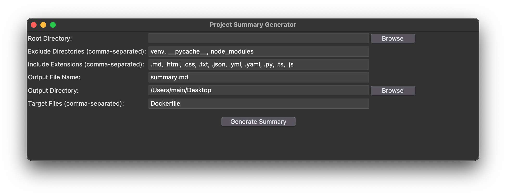

# Project Summary Generator

Project Summary Generatorは、指定されたディレクトリ内のファイルをマークダウン形式でまとめるPythonスクリプトです。プロジェクトを1つのファイルにまとめて生成AIに質問するときに利用します。



## 機能

- 指定したディレクトリ内のファイルをマークダウン形式で出力
- 除外するディレクトリを指定可能
- 含めるファイル拡張子を指定可能
- 出力ファイル名と出力ディレクトリを指定可能
- 特定のファイル名を指定して取得可能

## 使用方法

1. `gui.py`を実行してGUIを起動します。
2. "Root Directory"の"Browse"ボタンをクリックし、サマリーを生成するプロジェクトのルートディレクトリを選択します。
3. "Exclude Directories"に、除外するディレクトリ名をカンマ区切りで入力します。（例: `venv, __pycache__, node_modules`）
4. "Include Extensions"に、含めるファイル拡張子をカンマ区切りで入力します。（例: `.md, .html, .css, .txt, .json, .yml, .yaml, .py, .ts, .js`）
5. "Output File Name"に、出力するサマリーファイルの名前を入力します。（例: `summary.md`）
6. "Output Directory"の"Browse"ボタンをクリックし、サマリーファイルの出力先ディレクトリを選択します。
7. "Target Files"に、特定のファイル名を指定する場合は、カンマ区切りで入力します。（例: `Dockerfile, README.md`）
8. "Generate Summary"ボタンをクリックすると、指定した条件に基づいてプロジェクトのサマリーが生成されます。

## 必要な環境

- Python 3.x
- tkinter (Pythonの標準ライブラリ)

## インストール方法

1. 以下のコマンドを実行して、GitHubからこのリポジトリをクローンします。

   ```
   git clone https://github.com/noricha-vr/ProjectSummaryGenerator.git
   ```

2. クローンしたディレクトリに移動します。

   ```
   cd ProjectSummaryGenerator
   ```

3. `gui.py`を実行してGUIを起動します。

   ```
   python gui.py
   ```

## ライセンス

このプロジェクトはMITライセンスの下で公開されています。詳細は[LICENSE](LICENSE)ファイルをご覧ください。

## 貢献

プルリクエストや issue は歓迎します。改善点や新機能のアイデアがある場合は、お気軽にご連絡ください。
