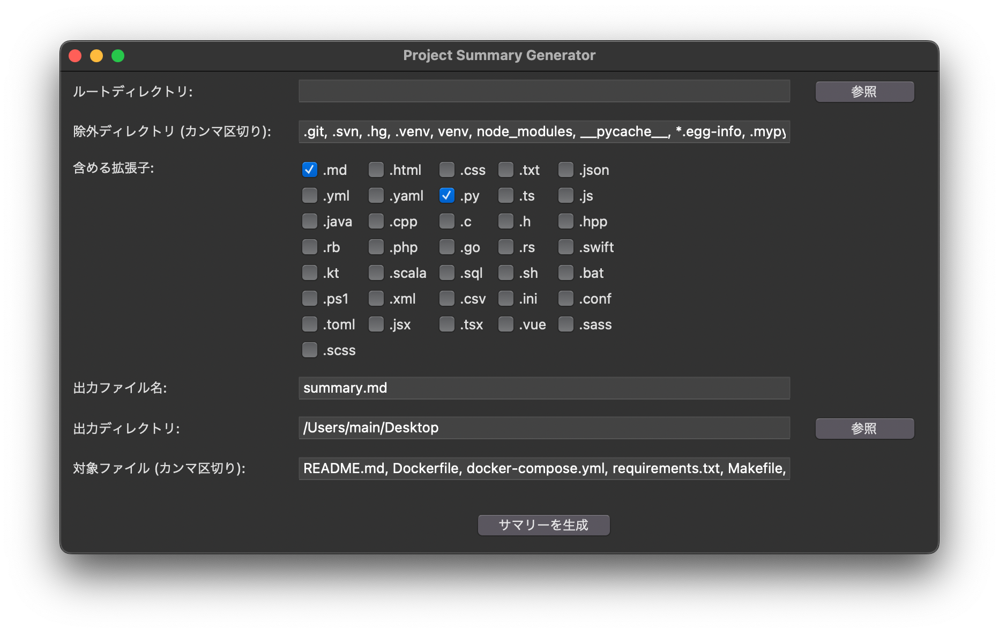

# Project Summary Generator

Project Summary Generator は、指定されたディレクトリ内のファイルをマークダウン形式で要約するPythonアプリケーションです。プロジェクトの概要を1つのファイルにまとめ、生成AIに質問するのに便利です。



## 機能

- 指定したディレクトリ内のファイルをマークダウン形式で出力
- 除外するディレクトリを指定可能
- 含めるファイル拡張子をチェックボックスで選択可能
- 出力ファイル名と出力ディレクトリを指定可能
- 特定のターゲットファイルを指定して取得可能
- ディレクトリ構造を4階層まで表示
- プリセット機能：設定を保存・読み込み可能

## 使用方法

1. `gui.py` を実行してGUIを起動します。
2. "ルートディレクトリ" の "参照" ボタンをクリックし、サマリーを生成するプロジェクトのルートディレクトリを選択します。
3. "除外ディレクトリ" に、除外するディレクトリ名をカンマ区切りで入力します。デフォルトの除外ディレクトリが設定されています。
4. "含める拡張子" で、含めるファイル拡張子のチェックボックスを選択します。
5. "出力ディレクトリ" の "参照" ボタンをクリックし、サマリーファイルの出力先ディレクトリを選択します。
6. "対象ファイル" に、特定のファイル名を指定する場合は、カンマ区切りで入力します。デフォルトのターゲットファイルが設定されています。
7. "サマリーを生成" ボタンをクリックすると、指定した条件に基づいてプロジェクトのサマリーが生成されます。
8. 生成が完了すると、サマリーファイルの場所が表示され、出力ディレクトリを開くオプションが提供されます。

## 必要な環境

- Python 3.x
- tkinter (Pythonの標準ライブラリ)
- tree コマンド (ディレクトリ構造の表示に使用)

## インストール方法

1. 以下のコマンドを実行して、GitHubからこのリポジトリをクローンします：

```
git clone https://github.com/noricha-vr/ProjectSummaryGenerator.git
```

2. クローンしたディレクトリに移動します：

```
cd ProjectSummaryGenerator
```

3. `gui.py` を実行してGUIを起動します：

```
python gui.py
```

## 設定

`config.py` ファイルで以下の設定を変更できます：

- `EXCLUDE_DIRS`: デフォルトで除外するディレクトリのリスト
- `DEFAULT_TARGET_FILES`: デフォルトのターゲットファイルのリスト
- `SUPPORTED_EXTENSIONS`: サポートするファイル拡張子のリスト
- `DEFAULT_OUTPUT_DIR`: デフォルトの出力ディレクトリ

## プリセット機能

- プリセットはプロジェクトごとに自動的に保存されます。
- プロジェクトのルートディレクトリを選択すると、そのプロジェクトの以前の設定が自動的に読み込まれます。
- プリセットは `summary.config.json` ファイルに保存されます。

## ライセンス

このプロジェクトはMITライセンスの下で公開されています。詳細は [LICENSE](LICENSE) ファイルをご覧ください。

## 貢献

プルリクエストやissueは歓迎します。改善点や新機能のアイデアがある場合は、お気軽にご連絡ください。

## テスト

`tests/test_main.py` にユニットテストが含まれています。テストを実行するには、以下のコマンドを使用してください：

```
python -m unittest tests/test_main.py
```

## 注意事項

- 大規模なプロジェクトや大量のファイルを含むディレクトリでは、処理に時間がかかる場合があります。
- バイナリファイルや特殊なエンコーディングを使用しているファイルは正しく処理されない可能性があります。